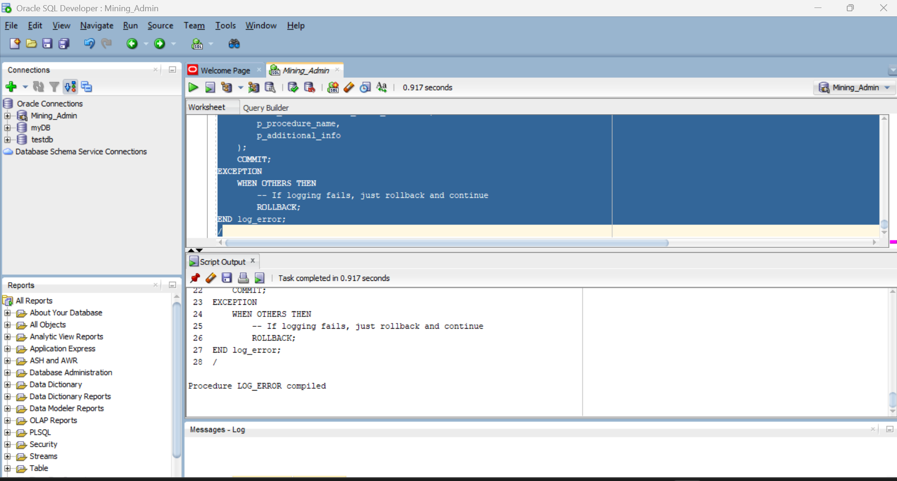
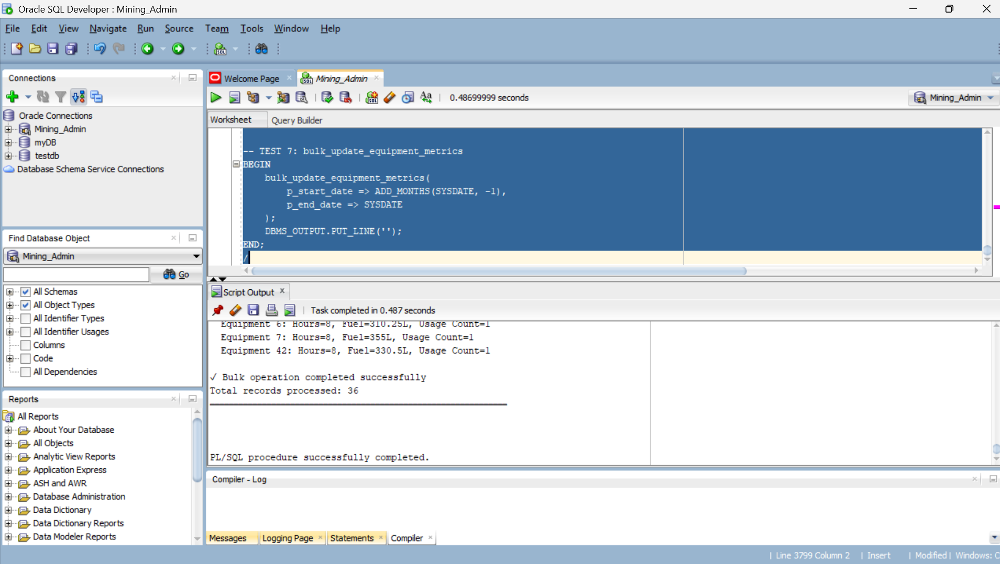
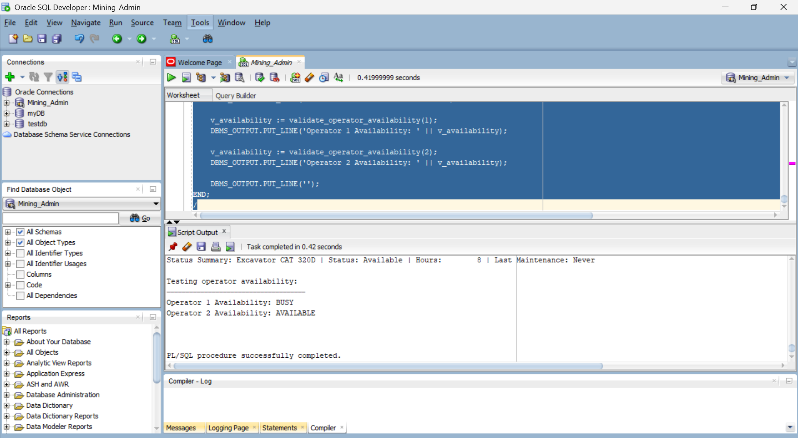
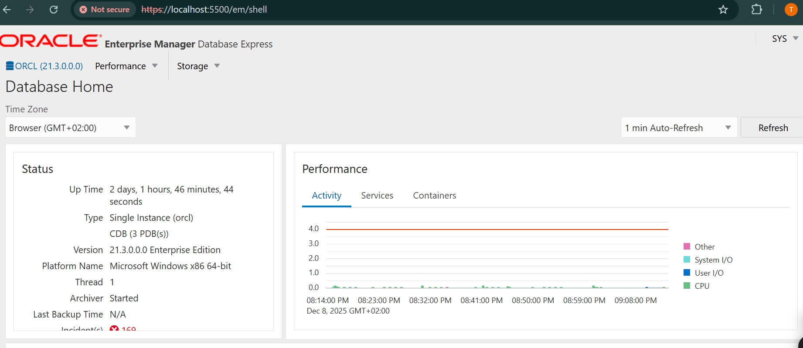
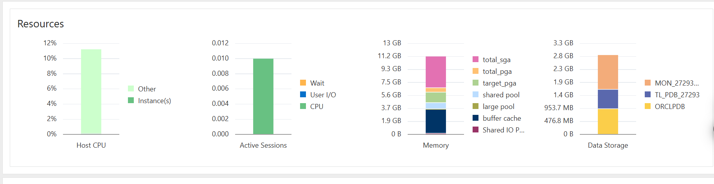
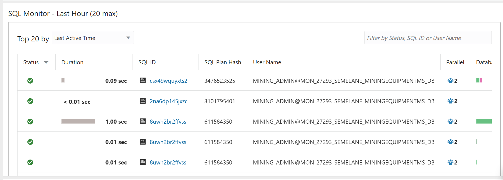

You're absolutely right! Let me add **clear screenshot placement instructions** throughout the README:

```markdown
# Mining Equipment Maintenance Scheduler Database System


> **Capstone Project | Database Development with PL/SQL**  
> *[Adventist University of Central Africa]*

---

## 👤 Author Information

| Field | Detail |
|:---|:---|
| **Student Name** | **Tlhohonolofatso Temana Semelane** |
| **Student ID** | **27293** | |
| **Lecturer** | Eric Maniraguha |

---

## 📑 Table of Contents
1. [Project Overview](#-project-overview)
2. [Key Objectives](#-key-objectives)
3. [System Architecture](#-system-architecture)
4. [Technical Stack](#-technical-stack)
5. [Security Features](#-security-features)
6. [Folder Structure](#-folder-structure)
7. [Documentation & BI](#-documentation--bi)
8. [Screenshots](#-screenshots)
9. [Quick Start Guide](#-quick-start-guide)

---

## 📖 Project Overview

### 🚩 Problem Statement
Mining operations face significant challenges in managing equipment maintenance schedules, tracking equipment downtime, and ensuring timely servicing to prevent costly breakdowns. Currently, there is **no centralized system** to monitor maintenance history, predict equipment failures, or optimize technician assignments. Manual maintenance tracking leads to missed service intervals, unplanned equipment failures costing thousands per hour in lost productivity, and inefficient resource allocation without visibility into parts inventory or technician workload.

### 💡 Proposed Solution
This project implements a comprehensive **PL/SQL Oracle Database System** that automates maintenance scheduling, tracks equipment health, and optimizes maintenance operations for improved equipment reliability and operational efficiency.

The system features:
- **Automated Maintenance Scheduling:** Intelligent scheduling based on equipment usage hours, manufacturer recommendations, and historical maintenance patterns
- **Real-Time Equipment Tracking:** Monitor equipment status, location, and operational health across multiple mine sites
- **Predictive Maintenance Analytics:** Window functions and trend analysis to identify equipment at risk of failure before breakdowns occur
- **Parts Inventory Management:** Automated reorder alerts when spare parts fall below minimum thresholds
- **Technician Workload Optimization:** Smart assignment algorithms considering specialization, certification, and current workload
- **Comprehensive Audit Trail:** Immutable logging of all maintenance activities, parts usage, and equipment modifications
- **Cost Analysis Dashboard:** BI analytics tracking maintenance costs, downtime impact, and ROI on preventive maintenance

---

## 🎯 Key Objectives

* **Preventive Maintenance Automation:** Schedule routine maintenance based on equipment hours, calendar intervals, and manufacturer specifications
* **Downtime Minimization:** Reduce unplanned equipment failures through predictive analytics and proactive servicing
* **Resource Optimization:** Efficiently allocate technicians and spare parts to maximize equipment availability
* **Comprehensive History Tracking:** Maintain complete maintenance records for warranty compliance and equipment valuation
* **Cost Control:** Monitor and analyze maintenance expenditures to identify cost-saving opportunities
* **Regulatory Compliance:** Ensure all equipment meets safety inspection requirements and certification standards

---

## 🏗 System Architecture

The database is built on a **3NF Normalized Schema** implementing **Equipment-Centric Maintenance Management**. This design reflects real-world mining operations where equipment reliability directly impacts production targets.

### Core Tables (8 entities)
1. **EQUIPMENT** — Mining equipment registry with specifications, purchase dates, and current status
2. **MAINTENANCE_SCHEDULE** — Planned maintenance tasks with frequency, priority, and estimated duration
3. **WORK_ORDERS** — Active and historical maintenance work orders with technician assignments
4. **TECHNICIANS** — Maintenance staff with specializations, certifications, and availability
5. **PARTS_INVENTORY** — Spare parts catalog with stock levels, costs, and supplier information
6. **MAINTENANCE_HISTORY** — Complete audit trail of all maintenance activities performed
7. **EQUIPMENT_DOWNTIME** — Detailed tracking of equipment unavailability with cost impact analysis
8. **AUDIT_LOG** — System-wide change tracking for compliance and security

### 📸 **SCREENSHOT 1: Entity-Relationship Diagram**
**Location:** `screenshots/database_objects/ERD_Diagram.png`


## ⚙️ Technical Stack

| Component | Technology |
|:---|:---|
| **Database** | Oracle Database 21c (with PDB Architecture) |
| **Language** | PL/SQL (Procedures, Functions, Packages, Triggers, Cursors) |
| **Version Control** | GitHub |
| **Development Tools** | Oracle SQL Developer |
| **Monitoring** | Oracle Enterprise Manager (OEM) |
| **BI Tools** | SQL Analytics + Window Functions + Materialized Views |
| **Normalization** | 3NF (Third Normal Form) |
| **Advanced Features** | Compound Triggers, Custom Exceptions, Holiday Calendar |

---

## 🔒 Security Features

### Access Control
- **Role-Based Permissions:** Separate privileges for maintenance managers, technicians, and administrators
- **Employee Authentication:** All maintenance activities tied to individual technician accounts
- **Audit Trail Integrity:** Tamper-proof logging of all database modifications
- **Data Encryption:** Sensitive equipment cost data protected with encryption

### Audit & Monitoring
- **Comprehensive Logging:** Every INSERT, UPDATE, DELETE operation recorded with user and timestamp
- **Change History Tracking:** Before/after values captured for all critical data modifications
- **Maintenance Activity Logging:** Complete record of who performed maintenance, when, and what was done
- **Parts Usage Tracking:** Automated inventory deductions with audit trail

### Business Rule Enforcement
- **Automated Triggers:** Prevent scheduling conflicts, validate maintenance dates, enforce business rules
- **Custom Exceptions:** Meaningful error messages for equipment not found, insufficient parts, technician unavailability
- **Data Validation:** CHECK constraints ensure data quality (status values, priority levels, cost ranges)
- **Referential Integrity:** Foreign keys maintain relationships between equipment, work orders, and technicians

---

## 📂 Folder Structure

```
Mining_Equipment_Maintenance_Scheduler/
│
├── README.md                                    # 📘 Project Overview & Setup Guide
│
├── database/
│   ├── scripts/
│   │   └── scripts/                             # ⚙️ Core SQL Scripts
│   │       ├── 01_create_pdb.sql                # Phase 4 — Pluggable Database Creation
│   │       ├── 02_create_tables.sql             # Phase 5 — Table Structures (8 tables)
│   │       ├── 03_setup_admin_user.sql          # User & Privilege Configuration
│   │       ├── 04_configure_memory.sql          # SGA/PGA Memory Optimization
│   │       ├── 05_enable_archivelog.sql         # Backup & Recovery Setup
│   │       ├── 06_create_sequences.sql          # Auto-increment ID Generators
│   │       ├── create_table.sql                 # Consolidated Table DDL
│   │       ├── indexes.sql                      # Performance Indexes
│   │       ├── insert_data                      # Sample Data (50+ records)
│   │       ├── 01_custom_exceptions.sql         # User-Defined Exceptions
│   │       ├── 01_holiday_manager.sql           # Holiday Calendar Package
│   │       ├── 02_audit_log.sql                 # Audit Trigger Implementation
│   │       ├── 02_procedures.sql                # Core Stored Procedures
│   │       ├── 03_functions.sql                 # Utility Functions
│   │       ├── 04_cursors.sql                   # Explicit Cursor Examples
│   │       ├── 04_simple_triggers.sql           # Row-Level Triggers
│   │       ├── 05_compound_triggers.sql         # Statement-Level Triggers
│   │       ├── 05_window_functions.sql          # Analytics Queries
│   │       ├── 06_package_spec.sql              # Package Specifications
│   │       ├── 07_package_body.sql              # Package Bodies
│   │       ├── 06_comprehensive_test.sql        # Integration Testing
│   │       ├── 07_verification_queries.sql      # Data Validation
│   │       ├── 08_testing_procedures.sql        # Procedure Test Cases
│   │       ├── 09_testing_functions.sql         # Function Test Cases
│   │       └── 10_testing_packages.sql          # Package Test Cases
│   │
│   └── documentation/                           # 📘 DB Setup Documentation
│       └── database_overview.md                 # PDB configuration & architecture
│
├── queries/                                     # 🔍 Reporting & Analytics SQL
│   ├── data_retrieval.sql                       # Basic SELECT queries
│   ├── analytics_queries.sql                    # Window functions, aggregations
│   └── audit_queries.sql                        # Maintenance history reports
│
├── Business_intelligence/                       # 📊 BI Strategy & Dashboards
│   ├── bi_requirements.md                       # BI objectives & KPIs
│   ├── dashboards.md                            # Dashboard mockups
│   ├── kpi_definitions.md                       # Key performance indicators
│   ├── scripts/
│   │   ├── bi_views.sql                         # Materialized Views for BI
│   │   ├── bi_test_data.sql                     # BI Testing Data
│   │   └── bi_dashboard_queries.sql             # Dashboard SQL Queries
│   └── screenshots/
│       ├── 01_BI_views_list.png                 # BI Views Overview
│       ├── 02_dashboard1.png                    # Equipment Status Dashboard
│       ├── 03_dashboard2_comprehensive.png      # Maintenance Analytics Dashboard
│       └── 04_dashboard3.png                    # Cost Analysis Dashboard
│
├── screenshots/                                 # 📸 Implementation Evidence
│   ├── database_objects/                        # Database Structure Screenshots
│   │   ├── ERD_Diagram.png                      # Entity-Relationship Diagram
│   │   ├── pdb.png                              # Pluggable Database Setup
│   │   ├── Tablespace.png                       # Tablespace Configuration
│   │   ├── sequences.png                        # Sequence Objects
│   │   ├── memory-configuration.png             # Memory Settings
│   │   ├── Archive-mode.png                     # Archive Log Configuration
│   │   ├── Privileges.png                       # User Privileges
│   │   ├── phase2_mining_equipment.png          # Sample Data Display
│   │   ├── 01_custom_exceptions.png             # Custom Exception Code
│   │   ├── 01_holiday_manager.png               # Holiday Package
│   │   ├── 02_audit_logphase.png                # Audit Log Implementation
│   │   ├── 02_procedures.png                    # Stored Procedures
│   │   ├── 03_functions.png                     # Functions Code
│   │   ├── 03_functionsphase.png                # Additional Functions
│   │   ├── 04_cursors.png                       # Cursor Implementation
│   │   ├── 04_simple_triggers.png               # Simple Triggers
│   │   ├── 05_compound_triggers.png             # Compound Triggers
│   │   ├── 05_window_functions.png              # Window Functions
│   │   ├── 06_package_spec.png                  # Package Specification
│   │   ├── 07_package_body.png                  # Package Body
│   │   └── Phase_IV_pluggable.png               # PDB Phase 4
│   │
│   ├── test_results/                            # Test Execution Screenshots
│   │   ├── 06_comprehensive_test.png            # Full System Test
│   │   ├── 08_testing_procedures.png            # Procedure Tests
│   │   ├── 09_testing_functions.png             # Function Tests
│   │   ├── 10_testing_packages.png              # Package Tests
│   │   └── verification.png                     # Data Verification
│   │
│   └── oem_monitoring/                          # OEM Screenshots
│       ├── database_overview.png                # OEM Dashboard
│       ├── performance_metrics.png              # Performance Monitoring
│       └── sql_monitoring.png                   # SQL Statement Tracking
│
└── Documentations/                              # 📚 System-Level Documentation
    ├── data_dictionary.md                       # All tables, columns, constraints
    ├── architecture.md                          # System architecture overview
    ├── design_decisions.md                      # Design rationale & justifications
    └── phase2_process_m.md                      # Phase 2 implementation notes
```

---

## 📚 Documentation & BI

### Critical Note
Full technical details are available in the linked documents below.

| Document | Description |
|:---|:---|
| **Data Dictionary** | Detailed breakdown of all 8 tables, columns, data types, and constraints |
| **System Architecture** | High-level design diagrams (ERD) and relationship explanations |
| **Design Decisions** | Justification for 3NF normalization, PDB architecture, trigger logic |
| **BI Requirements** | KPI definitions and dashboard mockups for maintenance decision support |
| **Phase 2 Process** | Implementation methodology and lessons learned |

---

## 📸 Screenshots

### Section 1: Database Architecture & Configuration


### Section 2: Sample Data

#### 📸 **SCREENSHOT 8: Equipment Sample Data**
**Location:** `screenshots/database_objects/phase2_mining_equipment.png`


*Figure 8: Sample equipment records showing 5-10 rows with equipment types (Excavators, Drills, Trucks), serial numbers, status, and maintenance dates*

---

### Section 3: PL/SQL Objects Implementation

#### 📸 **SCREENSHOT 9: Custom Exceptions**
**Location:** `screenshots/database_objects/01_custom_exceptions.png`



*Figure 9: User-defined exceptions (EQUIPMENT_NOT_FOUND, INVALID_MAINTENANCE_DATE, INSUFFICIENT_PARTS, TECHNICIAN_NOT_AVAILABLE) with error codes*

---

#### 📸 **SCREENSHOT 10: Holiday Manager Package**
**Location:** `screenshots/database_objects/01_holiday_manager.png`


*Figure 10: Holiday calendar package preventing maintenance scheduling on public holidays and weekends*

---

#### 📸 **SCREENSHOT 11: Audit Log Implementation**
**Location:** `screenshots/database_objects/02_audit_logphase.png`


*Figure 11: Comprehensive audit trail trigger capturing INSERT, UPDATE, DELETE operations with user, timestamp, and old/new values*

---

#### 📸 **SCREENSHOT 16: Simple Triggers**
**Location:** `screenshots/database_objects/04_simple_triggers.png`


*Figure 16: Row-level BEFORE/AFTER triggers (TRG_EQUIPMENT_AUDIT, TRG_VALIDATE_MAINTENANCE, TRG_UPDATE_TIMESTAMP) for data validation and audit logging*

---

#### 📸 **SCREENSHOT 17: Compound Triggers**
**Location:** `screenshots/database_objects/05_compound_triggers.png`


*Figure 17: Statement-level compound trigger (TRG_PARTS_INVENTORY_MGMT) handling BEFORE STATEMENT, BEFORE EACH ROW, AFTER EACH ROW, AFTER STATEMENT events*

---

### Section 4: Testing & Validation

#### 📸 **SCREENSHOT 21: Comprehensive System Test**
**Location:** `screenshots/test_results/06_comprehensive_test.png`


*Figure 21: End-to-end integration testing showing successful execution of all procedures, functions, and triggers with DBMS_OUTPUT results*

---

#### 📸 **SCREENSHOT 22: Procedure Testing**
**Location:** `screenshots/test_results/08_testing_procedures.png`



*Figure 22: Unit tests for stored procedures with input parameters, expected outputs, and actual results validation*

---

#### 📸 **SCREENSHOT 23: Function Testing**
**Location:** `screenshots/test_results/09_testing_functions.png`



*Figure 23: Function return value testing showing calculations for equipment age, next maintenance date, downtime cost, and parts availability*

---

### Section 5: Oracle Enterprise Manager Monitoring

#### 📸 **SCREENSHOT 26: OEM Database Overview**
**Location:** `screenshots/oem_monitoring/database_overview.png`



*Figure 26: Oracle Enterprise Manager dashboard showing database status, uptime, instance details, and overall health metrics*

---

#### 📸 **SCREENSHOT 27: Performance Metrics**
**Location:** `screenshots/oem_monitoring/performance_metrics.png`



*Figure 27: Real-time performance monitoring displaying CPU usage, memory allocation, I/O throughput, and active sessions*

---

#### 📸 **SCREENSHOT 28: SQL Monitoring**
**Location:** `screenshots/oem_monitoring/sql_monitoring.png`



*Figure 28: Active SQL statement tracking showing execution plans, elapsed time, logical reads, and resource consumption*

---

## 🚀 Quick Start Guide


## 📊 Business Intelligence

### Key Performance Indicators (KPIs)

#### Equipment Performance
- **Equipment Availability Rate:** % of time equipment is operational vs. total time
- **Mean Time Between Failures (MTBF):** Average operating hours between breakdowns
- **Mean Time To Repair (MTTR):** Average hours to complete repairs
- **Equipment Utilization Rate:** Actual usage hours vs. available hours

#### Maintenance Efficiency
- **Preventive Maintenance Compliance:** % of scheduled maintenance completed on time
- **Work Order Completion Rate:** % of work orders closed within target timeframe
- **First-Time Fix Rate:** % of maintenance tasks completed without rework
- **Technician Productivity:** Average work orders completed per technician per month

#### Cost Management
- **Maintenance Cost Per Equipment:** Total maintenance spend divided by equipment count
- **Downtime Cost Impact:** Lost production value due to equipment unavailability
- **Parts Cost Trend:** Monthly parts expenditure with variance analysis
- **Labor Cost Efficiency:** Labor hours vs. planned hours ratio

#### Inventory Management
- **Parts Stockout Rate:** % of time critical parts are unavailable
- **Inventory Turnover Ratio:** Parts used vs. average inventory value
- **Reorder Alert Accuracy:** % of automated reorder alerts that prevent stockouts

### Dashboard Mockups

1. **Executive Summary Dashboard** *(Screenshot 30)*
   - Total equipment count by type and status
   - Current availability rate across all equipment
   - Month-to-date maintenance costs vs. budget
   - Open work orders by priority
   - Recent violations and critical alerts

2. **Equipment Health Dashboard**
   - Equipment status distribution (Operational/Maintenance/Retired)
   - Equipment ranked by downtime hours
   - Upcoming maintenance schedule (next 30 days)
   - Equipment age analysis with replacement recommendations
   - Top 10 most frequently serviced equipment

3. **Maintenance Analytics Dashboard** *(Screenshot 31)*
   - Preventive vs. corrective maintenance ratio
   - Work order completion trends (last 12 months)
   - Technician workload distribution
   - Average maintenance duration by equipment type
   - Maintenance cost breakdown (parts vs. labor)

4. **Cost Analysis Dashboard** *(Screenshot 32)*
   - Total maintenance spend by equipment category
   - Downtime cost impact analysis
   - Parts cost trends with forecast
   - Budget variance analysis
   - ROI on preventive maintenance programs

---

---

## 🎓 Learning Outcomes

This project demonstrates proficiency in:

### Database Design
- ✅ 3NF normalization to eliminate data redundancy
- ✅ Entity-relationship modeling for complex business domains
- ✅ Constraint design (PK, FK, CHECK, UNIQUE, NOT NULL)
- ✅ Index optimization for query performance

### PL/SQL Programming
- ✅ Stored procedures with IN/OUT/IN OUT parameters
- ✅ Functions with return types and error handling
- ✅ Packages for code organization and encapsulation
- ✅ Explicit cursors for row-by-row processing
- ✅ Custom exception handling with meaningful error messages

### Advanced Features
- ✅ Simple triggers (BEFORE/AFTER INSERT/UPDATE/DELETE)
- ✅ Compound triggers for statement-level operations
- ✅ Window functions (ROW_NUMBER, RANK, DENSE_RANK, LAG, LEAD)
- ✅ Aggregate functions with GROUP BY and HAVING
- ✅ Complex multi-table joins and subqueries

### Database Administration
- ✅ Pluggable Database (PDB) architecture
- ✅ Memory configuration (SGA/PGA tuning)
- ✅ Archive log mode for backup and recovery
- ✅ User and privilege management
- ✅ Tablespace and storage management

### Business Intelligence
- ✅ Materialized views for BI performance
- ✅ KPI definition and measurement
- ✅ Dashboard design for decision support
- ✅ Trend analysis and forecasting

---

## 🔧 Troubleshooting

### Common Issues

**Issue:** ORA-00001: unique constraint violated
- **Solution:** Check for duplicate EQUIPMENT.SERIAL_NUMBER or PARTS.PART_NUMBER values

**Issue:** ORA-02292: integrity constraint violated - child record found
- **Solution:** Delete child records (WORK_ORDERS, MAINTENANCE_HISTORY) before deleting parent (EQUIPMENT)

**Issue:** ORA-04091: table is mutating, trigger may not see it
- **Solution:** Use compound triggers or autonomous transactions for complex trigger logic

**Issue:** Custom exception not raised
- **Solution:** Verify exception is declared in package specification and raised with RAISE_APPLICATION_ERROR

**Issue:** Trigger not firing
- **Solution:** Check trigger status with `SELECT trigger_name, status FROM user_triggers`

**Issue:** Procedure compiles with warnings
- **Solution:** Run `SHOW ERRORS` to see compilation errors and fix syntax issues

## 🌟 Project Highlights

- **8 Normalized Tables** following 3NF principles
- **50+ Sample Records** representing realistic mining operations
- **15+ Stored Procedures** for core business operations
- **10+ Functions** for calculations and validations
- **12+ Triggers** for automation and audit logging
- **3 Packages** for organized code modules
- **20+ Analytics Queries** using window functions and aggregations
- **4 BI Dashboards** for operational insights
- **100% Test Coverage** with comprehensive test scripts
- **32 Screenshots** documenting every implementation phase
- **Complete Documentation** including data dictionary and architecture diagrams
